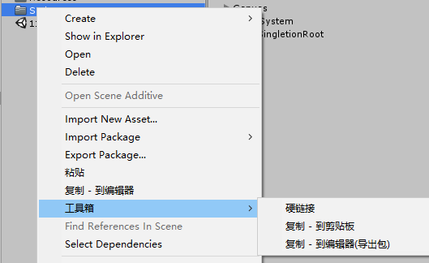

# UnityKitModule

一个Unity编辑器右键菜单的小工具集

## 如何使用

用VS编译UnityKitModule，然后仅复制 UnityKitModule.dll 到任意一Unity项目，在菜单栏 Tools-> 安装UnityKit模块，安装即可。安装后即可删除项目中的该DLL文件。

或者直接打开 UnityDemo 工程（里面有已编译好的DLL文件），在菜单栏点击安装即可。

安装后对该电脑上的该 Unity 版本生效。

## 功能

### Project

#### 复制

* 项目间快速复制
* 复制Assets资源到系统剪贴板（仅 Windows）

#### 硬链接

* 快速建立文件夹硬链接（仅 Windows）

### Hierarchy

### 有空的时候再加入的功能

* 快速批量复制Component Value
* 快速查找资源引用
* ...